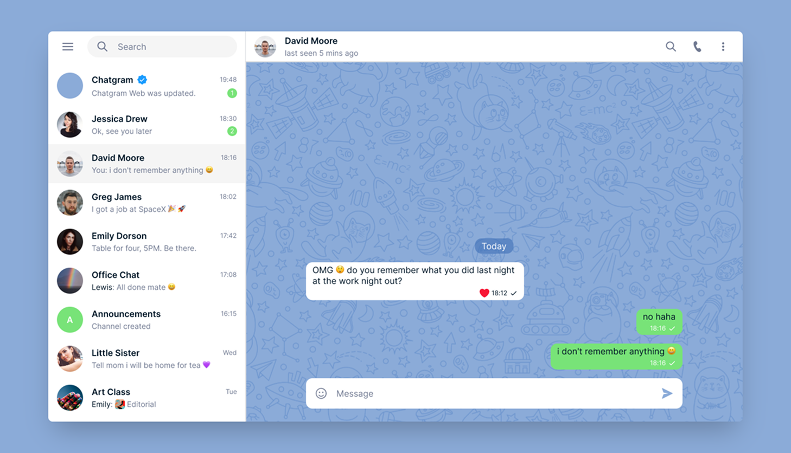

# 💬 Chatgram – Renan Guilherme

Chat Fake desenvolvido com HTML e CSS utilizando Flexbox para treinar layout e posicionamento de elementos de forma moderna e responsiva.

---

## 🚀 Sobre o Projeto

O **Chatgram** é um projeto de front-end construído para praticar e consolidar os conhecimentos em **CSS Flexbox**. Ele simula a interface de um chat moderno, com seções visuais como lista de contatos, área principal de conversa e cabeçalho.

---

## 🛠️ Tecnologias Utilizadas

- HTML5  
- CSS3 (Flexbox)

---

## 📐 Estrutura do Projeto

📦 chatgram
┣ 📂 src
┃ ┣ 📂 assets
┃ ┃ ┣ 📂 css
┃ ┃ ┣ 📂 icons
┃ ┃ ┗ 📂 images
┣ 📄 index.html

---

## 🧩 Funcionalidades e Layout

- ✅ Lista de Contatos  
- ✅ Header (cabeçalho do chat)  
- ✅ Tela de Conversa (interface simulada)  
- ❌ Sem funcionalidades dinâmicas (projeto estático)

---

## 🌐 Deploy

Você pode visualizar o projeto online através do link:  

🔗 [Chatgram no GitHub Pages](https://codebyneander.github.io/chat/)

---

## 📚 Aprendizados

Esse projeto foi essencial para reforçar o domínio do **Flexbox**, principalmente no alinhamento de elementos em colunas e linhas, espaçamento entre blocos e construção de layouts mais profissionais com HTML e CSS puros.

---

## 📸 Demonstração

> A imagem de pré-visualização está no início deste README.  
Você também pode testar o projeto acessando o link de deploy acima.

---

## 🙋‍♂️ Autor

Feito com 💙 por **Renan Guilherme**
